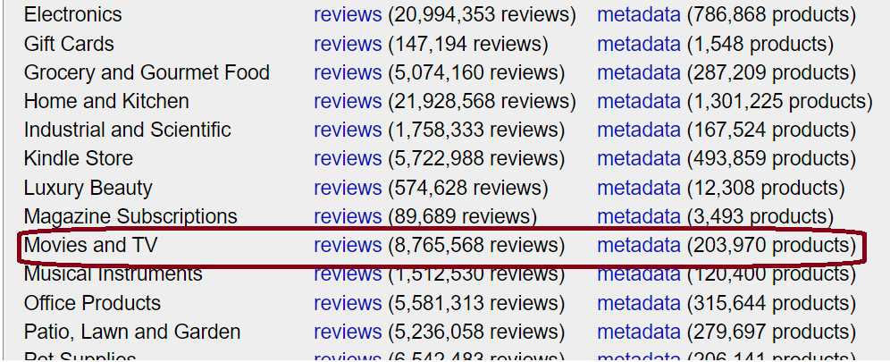
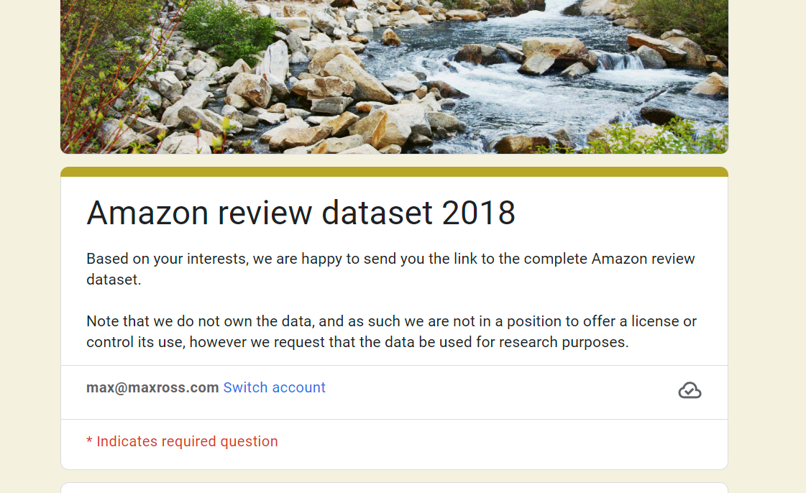
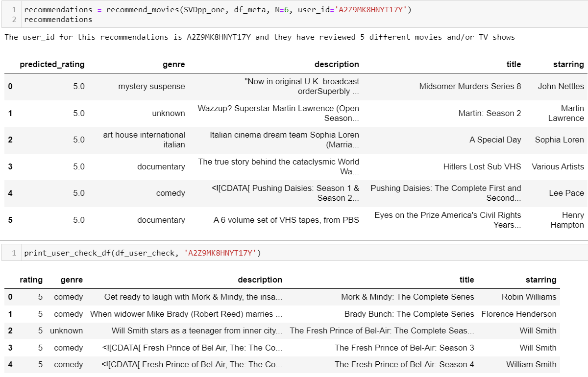
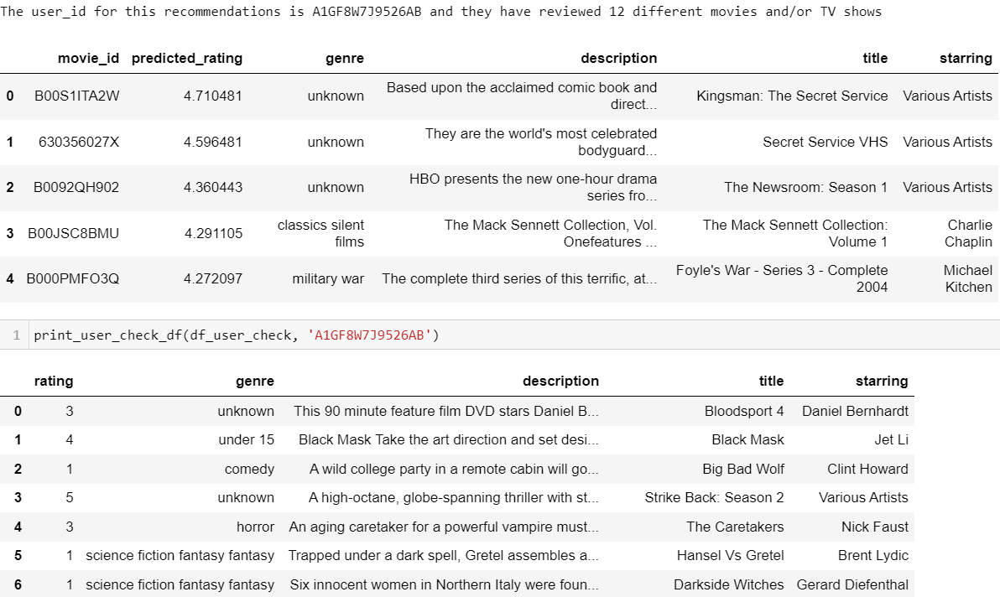
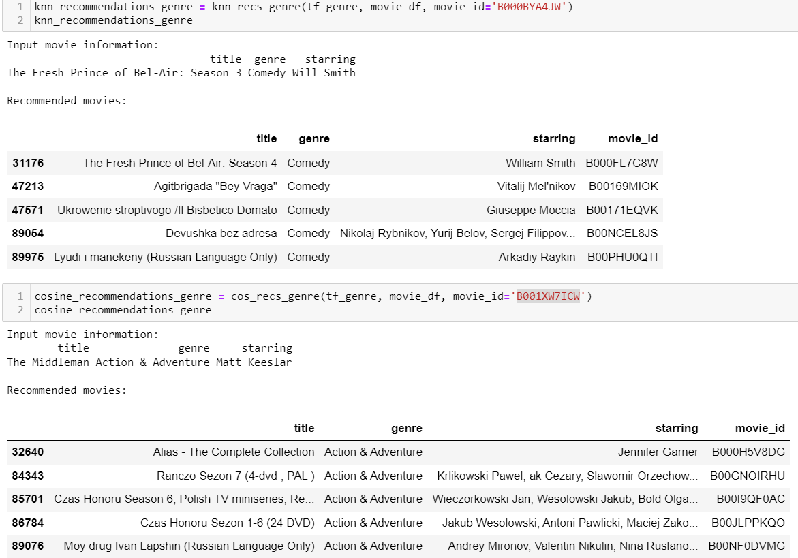

#### TV & Movie recommendation system using a collaborative and content based filtering approach

<!-- #region -->
# Project Overview
The main goal for this project is to Develop a movie/TV recommendation system using two different approaches. Collaborative filtering and content-based filtering to suggest new content to users.

**Collaborative Filtering**: Analyzes existing user profiles to discover shared preferences and recommend new content based on similarities.

**Content-Based Filtering**: Suggests new content with similar fearures to the movie/TV show that you input.


# Business Understanding
As streaming platforms pile-up content, users struggle to pinpoint films or shows that align with their tastes. The dubious presence of bias in platform algorithms exacerbates this challenge, making it harder for users to rely on platform recommendations. Biases emerge from factors like skewed user preferences, popularity bias, or even the platform's promotional agenda. As a result, recommended content may not cater to users' unique tastes, negatively affecting the overall user experience.

Streaming platforms stand to gain from implementing an unbiased recommendation system that utilizes either a content-based or collaborative filtering approach. The content-based technique analyzes features like genre and content description, while collaborative filtering harnesses the collective trends of user ratings. They are both powerful recommendation engines.


# Data Understanding
The data used in the Film Finder project comes from the Amazon Review Data (2018) dataset found [here](https://nijianmo.github.io/amazon/index.html) which was originally sourced by Jianmo Ni, UCSD for their paper [“Justifying recommendations using distantly-labeled reviews and fined-grained aspects”](https://cseweb.ucsd.edu//~jmcauley/pdfs/emnlp19a.pdf). 

The raw files are stored as compressed JSON files, with each JSON entry on its own line. To access the larger files, such as the 'Movies And TV' reviews and metadata files used in this project, you need to fill out a google form linked from the source site.

This dataset spans from May 1996 to October 2018, with our analysis focusing on the Movies and TV category, comprising 8,765,568 reviews and metadata for 203,970 products.

The dataset offers user reviews and metadata for various films and TV shows, allowing us to better understand user preferences and industry trends.

### Key dataset features:
**overall**: User-assigned ratings from 1 to 5.

**verified**: Indicates if the user actually purchased or streamed the product.

**reviewerID**: Unique Amazon user ID.

**asin**: Unique Amazon product identification number.

**style**: Format of the movie or TV show (e.g., streaming, DVD, VHS, etc.).

**description**: Synopsis/summary of the movie or TV show.

**reviewText**: User's review text.

**brand**: Starring or leading role of the film.

### Dataset limitations:
- The category feature, with genre and sub-genre details, has ambiguous labels, complicating recommendation accuracy and trend analysis.
- The description feature contains missing or unusable information in at least a third of entries, which restricts accurate suggestions based on plot summaries.
- The brand feature, despite listing the leading role, lacks comprehensive cast information, potentially limiting actor/actress-based recommendations.
- The dataset doesn't extend beyond 2018, limiting insights into recent viewership trends.

# Data Preparation

### Initial Dataset Access
Access review and metadata files, which are stored as compressed JSON files with separate entries on each line. For larger files like 'Movies and TV' reviews and metadata, fill out a Google Form provided by their respective links.




### Data Conversion
Uncompress JSON files and convert them using Pandas. 


### Data Cleaning
Perform data cleaning using Pandas, Numpy, and Python's ast module[(Abstract Syntax Trees)](https://docs.python.org/3/library/ast.html)


### EDA - Part 1: Metadata
**Remove unused features**: Discard unnecessary features for collaborative and content-based filtering, focusing on null or redundant information.

**Remove unused main_cat**: Discard all main categories not labeled as 'Movies & TV'.

**Extract genres**: Parse category to acquire specific genres/subgenres for movies/TV shows.

**Extract leading roles**: Analyze brand to obtain leading roles in films.

**Preprocess descriptions**: Clean description, isolating valuable information, and remove duplicates for text preprocessing and vectorization efficiency in the content-based filtering system.

### EDA - Part 2: User Review Data
**Remove unused features**: Discard unnecessary features for collaborative and content-based filtering, focusing on null or redundant information.

**Extract video content formats**: Parse format to obtain the top 4 formats, excluding VHS for relevancy.

**Keep verified reviews only**: Eliminate unverified reviews to maintain data validity.

**Remove duplicate reviews**: Discard duplicates based on asin and reviewerID to avoid bias.

**Match review with metadata**: Using cleaned metadata dataframe, remove review entries with movie/TV show IDs not found in the cleaned metadata dataframe.

**Filter by user review count**: Remove user IDs with less than 5 reviews to enhance dataset size and model effectiveness. Chose the count of 5 after comparing against counts of 3, 4, and 6 based on the BaselineOnly() model's prediction score from Python's scikit Surprise module for recommender systems.[(Surprise Documentation found here)](https://surprise.readthedocs.io/en/stable/)


# Modeling

# Collaborative Filtering

Collaborative filtering hinges on the comparison of user profiles to pinpoint shared movie preferences, focusing on ratings assigned by users. The following outlines the procedure:

- Developed a base model predicting mean ratings for each movie as a benchmark.
- Iterated over SVD and SVDpp models to enhance recommendations. Employed cross-validation alongside GridSearchCV to determine optimal parameters, thereby optimizing performance.
- Achieved an RMSE score of 0.908 through cross-validation and GridSearchCV, indicating satisfactory predictions of user ratings (1-5 scale) and facilitating precise, tailored recommendations based on common preferences.

### Recommending Content function:
**recommend_movies()**: Function that offers content recommendations to existing users based on the trained SVDpp collaborative filtering model. Accepts user ID, model, DataFrame (akin to movie and TV meta DataFrame), and optional N parameter (default 10) for suggesting N movies.

By sorting predicted user ratings for unseen movies in descending order, the function presents the top N movie details, like titles and ratings, factoring in user tastes and similarities with others.
Example Recommendation: 


## Performance & Evaluation:

During the analysis of the collaborative filtering recommendation system, we found that recommendations for users with limited high-rated Comedy TV Shows didn't align well with their preferences.


### Possible Causes
- **Vast dataset**: The large and diverse dataset may cause users with a small set of highly-rated videos to correlate strongly with users who reviewed varied movies but rated the same shows highly.
- **Similarity metric**: The current system treats varied-preference users as similar, resulting in inaccurate recommendations.

### Recommended Actions
- **Increase minimum reviews**: Filter users with more than the current minimum number of reviews (4) for better comparisons.
- **Customize similarity metric**: Implement a weighted similarity metric considering overlapping movies and users' genre importance.

These steps could potentially enhance the recommendation system's effectiveness, providing more relevant recommendations for each user profile.


##### future steps sidenote: Since the dataset is so large, it may make more sense to use the BaselineOnly model if not able to increase the difference in the hyperparameter tuned final model in order to save computation.


# Content Based Filtering
The content-based filtering recommendation system utilizes a cleaned dataset with 67,935 movies and TV shows, spanning 24 genres with accurate summaries. The following steps outline its creation:

wordcloud prior to preprocessing:


- Preprocessed 'description' using techniques such as removing stopwords, employing regexTokenizer, and applying WordNetLemmatizer from the NLTK module.
- Used a custom WordNet function, curtosy of The Flatiron School,d to translate NLTK POS tags to WordNet tags.
- Visually analyzed a frequency plot across all genre targets, created in the last project I collaborated on, [github found here.](https://github.com/ParkedHampster/Twitter-Brand-Perception) , to pinpoint & remove common words among genres, thus boosting the impact of extracted features via TfidfVectorizer.
- With the improved preprocessed 'description', TfidfVectorizer from scikit-learn extracted 460 common words across genres.
- One-hot encoded 'genre' column, resulting in 24 distinct genres as features. In total, 484 features were obtained, considering genres and frequent words. Restricted features to under 500 for better efficiency, reduced overfitting, and simpler model evaluation.

### Similarity Algorithm Functions:

**cos_recs_genre()**: Calculates similarity scores between movies using cosine_similarity() from sklearn, leveraging TF-IDF features.

**knn_recs_genre()**: Employs NearestNeighbors model from sklearn with 'cosine' metric, conducting k-nearest neighbors search based on cosine similarity.



Both return the top 5 recommendations for a movie. The first calculates the cosine similarity matrix directly, while the second utilizes a k-nearest neighbors model.

## Performance & Evaluation:

After the evaluation and analysis of the content-based filtering system for recommending similar movies, it was suggested to preprocess the description features for better specificity of the vectorized dataset. To increase the effectiveness of content modeling, NLP could be utilized for sub-genre classification instead of manual filtering. Analyzing purely streaming video content could also provide more insight for the system. The system performed well in recommending content of the same genre, but it lacked accuracy in capturing minute differences in specific sub-genres. Thus, resulting in less relevant recommendations for broader genres in the dataset. Exploring ways to improve the specificity and accuracy of the system is recommended for better recommendations.


# Conclusions:

Through the analysis of the collaborative and content-based filtering systems, we have developed two robust recommendation engines for movies and TV shows. The system utilizes a vast dataset of over 8 million reviews and 200,000 metadata movies and TV shows. The collaborative filtering system provides personalized recommendations based on similar user preferences, while the content-based filtering system recommends similar movies based on extracted features such as genre and description.

The collaborative filtering approach is a great starting point for recommending videos and can be used to enhance the user experience on streaming platforms. The content-based filtering approach provides accurate results for recommending similar movies within the same genre, but it struggles recommend relavant content when the genre is more broad.


# Next Steps
 - Compare User Reviews vs Movie Descriptions for features of the content based system, using one over the other or both.
 - Further Filtering of Genres using NLP and a Classification Model based on re-ingineered content based features
 - Combine the Collaborative and Content based system to create a hybrid model. (Filtering by Collaborative first and then Content Based Filtering)
 - Host an app using the hybrid recommendation system
<!-- #endregion -->

## Contact Information

| Data Scientist | Github | email|
| ---: | --- | --- |
| Max | [https://github.com/ImMaxRoss](https://github.com/ImMaxRoss) | [max@maxross.com](max@maxross.com) |


<!-- #region -->
## Repo Structure

```bash
.
├── code
├── img
├── Jupyter_Notebooks
├── LICENSE
├── README.md
├── collaborative_filtering.ipynb
├── content_based_filtering.ipynb
├── data_preparation.ipynb
└── film_finder.pdf
```
<!-- #endregion -->
